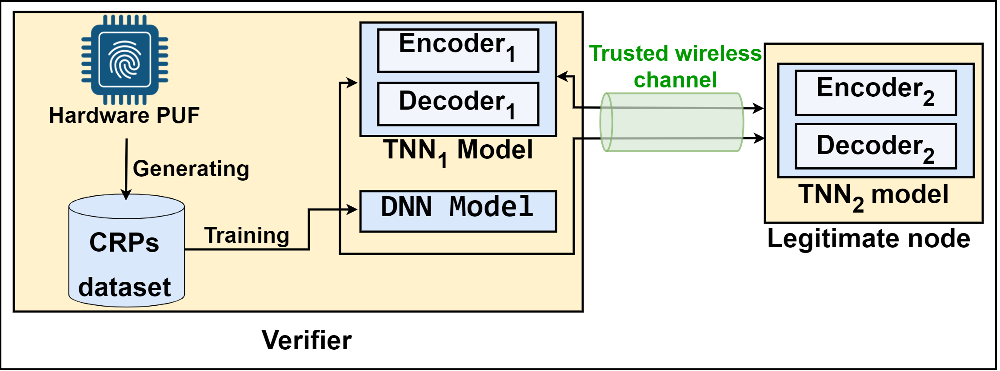
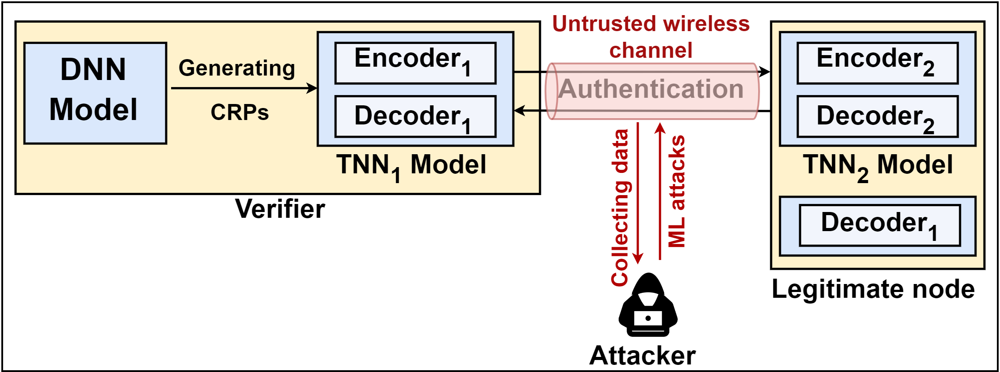

# LPUF-AuthNet: A Lightweight PUF-Based IoT Authentication via Tandem Neural Networks and Split Learning
This code is used in a manuscript submission under the title: "LPUF-AuthNet: A Lightweight PUF-Based IoT Authentication via Tandem Neural Networks & Split Learning".
## Overview
This paper explores the challenges of securing IoT devices, particularly in authentication processes. The widespread adoption of the Internet of Things (IoT) has revolutionized various aspects of daily life through advanced connectivity, automation, and intelligent decision-making. However, traditional cryptographic methods often struggle with the constraints of IoT devices, such as limited computational power and storage.

We investigate physical unclonable functions (PUFs) as robust security solutions, utilizing their inherent physical uniqueness to authenticate devices securely. Our research addresses the limitations of traditional PUF systems, which are vulnerable to machine learning attacks and burdened by large datasets.  We propose a novel lightweight PUF authentication scheme termed  <code style="color : black">**LPUF-AuthNet**</code>, which comprises two ML models: <code style="color : black">**deep neural networks (DNN)**</code>   and <code style="color : black">**tandem neural networks (TNN)**</code> trained using <code style="color : black">**split learning (SL)</code> paradigm. The proposed architecure reduces storage and communication demands, provides mutual authentication, enhances security by resisting different types of attacks, and supports scalable authentication, paving the way for secure integration into future 6G technologies.


<p align="center">
  <table>
    <tr>
      <td align="center">
        
        <p><strong>Figure 1:</strong> Enrollment Phase</p>
      </td>
      <td align="center">
        
        <p><strong>Figure 2:</strong> Authentication Phase</p>
      </td>
    </tr>
  </table>
</p>


## Repository Contents 

This repository comprises four main folders, organized as shown in the following hierarchy: 

    .
    ├── Scripts                  
    │   ├── TrainingTNN.py
    │   ├── LPUF-AuthNet-Models.py
    │   ├── AuthenticationAccuracy.py
    │   ├── AuthenticationAccuracy.py
    │   ├── MLAttacks.py
    ├── Trained models
    │   ├── DNN.h5
    │   ├── best_model.pth
    │   ├── best_model2.pth
    ├── Dataset
    │   ├── CRP_FPGA_01 - Copy.csv
    │   ├── GeneratorDataset.csv
    │   ├── MLAttackDataset.csv
    ├── Figures                   
    │   ├── Authentication_Phase.png
    │   ├── Enrollement_Phase.png
    │   ├── Training Architecture.png

### Scripts:  
- <code style="color: black">TrainingTNN.py:</code> This is the main script for training the LPUF-AuthNet models. It is used to train the $Encoder_1$, $Decoder_1$, $Encoder_2$, $Decoder_2$, enhanced $Encoder_1$, and enhanced $Encoder_2$. The trained models are saved as best_model.pth and best_model2.pth in the Trained Models directory.

- <code style="color: black">LPUF-AuthNet-Models.py:</code> This script contains the definitions of the LPUF-AuthNet models.

- <code style="color: black">AuthenticationAccuracy.py:</code> This script evaluates the model in terms of latent challenge authentication accuracy.

- <code style="color: black">MLAttacks.py:</code> This script is used for training adversarial machine learning models, including SVM and NN, and compares their accuracy in predicting the likelihood ratio (LR) of the corresponding latent challenge (LC).

- <code style="color: black">TestingTNNAccuracy.py:</code> This script evaluates the accuracy of the TNN models, including $Encoder_1$, $Decoder_1$, $Encoder_2$, $Decoder_2$, enhanced $Encoder_1$, and enhanced $Encoder_2$.

- <code style="color: black">TrainingDNN.py:</code> This script is used to train the CRP generator.


### Trained models: 
- **DNN.h5**: A Deep Neural Network model designed to generate novel Challenge-Response Pairs (CRPs). It accepts a hexadecimal number in binary format as input and produces a CRP as output. This model is trained using the `TrainingDNN.py` script.

- **best_model.pth**: This model encompasses $$Encoder_1$$, $$Encoder_2$$, and $$Decoder_2$$. It is the outcome of the training process illustrated in Phase A of the figure below.

- **best_model2.pth**: This model includes $$Enhanced\_Encoder_1$$, $$Enhanced\_Encoder_2$$, and $$Decoder_1$$. It results from the training process depicted in Phase B of the figure below.

- **accuracy_results2.pkl**: A pickle file that stores the predictions of the Machine Learning adversary, facilitating the plotting of results.

### CSV files: 
- <code style="color : black">**CRP_FPGA_01 - Copy.csv:**</code> A subset of the CRPs dataset utilized in our paper, comprising 10% of the total dataset.

- <code style="color : black">**GeneratorDataset.csv:**</code>: A dataset containing binary text that indexes each CRP in the file <code style="color : black">CRP_FPGA_01 - Copy.csv</code>. This file is used to train the CRP generator (DNN).

- <code style="color : black">**MLAttackDataset.csv**</code>: A dataset containing binary text that indexes each CRP in the file <code style="color : black">CRP_FPGA_01 - Copy.csv</code>. This file is used to train the CRP generator (DNN).


<p align="center">
  
<p align="center">
  <strong>Figure 2:</strong> Enrollment Phase
</p>
</p>

## Requirements
To run the code in this repository, you need the following:

- Python 3.7 or higher
- Torch
- Numpy
- Pandas
- Matplotlib
- Scikit-learn

## Installation 
1. Clone the repository:

```
git clone https://github.com/yourusername/LPUF-AuthNet.git
cd LPUF-AuthNet
```
or donwload the repository from the fellowing link: 

```
https://github.com/BrahiM-Mefgouda/LPUF-AuthNet/archive/refs/heads/main.zip
```

2. Install the required packages using pip:
```
pip install -r requirements.txt
```

## Usage

If you have a dataset of CRPs you should replace it  

1. Train the models by running the script <code style="color : LightSkyBlue">LPUF-AuthNet-Models.py.csv:</code>


## Copyright and license


## Citation

