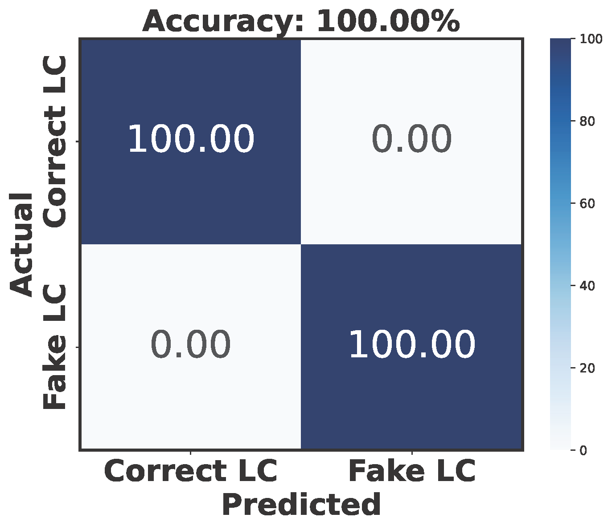

# LPUF-AuthNet: A Lightweight PUF-Based IoT Authentication via Tandem Neural Networks and Split Learning
This repository contains the code used in the manuscript submission titled: "LPUF-AuthNet: A Lightweight PUF-Based IoT Authentication via Tandem Neural Networks and Split Learning".

## Overview
This research addresses the challenges of securing IoT devices, particularly in authentication processes. As the Internet of Things (IoT) continues to revolutionize various aspects of daily life through advanced connectivity, automation, and intelligent decision-making, traditional cryptographic methods often struggle with the constraints of IoT devices, such as limited computational power and storage.

We investigate physical unclonable functions (PUFs) as robust security solutions, utilizing their inherent physical uniqueness to authenticate devices securely. Our research addresses the limitations of traditional PUF systems, which are vulnerable to machine learning attacks and burdened by large datasets.

We propose a novel lightweight PUF authentication scheme termed **LPUF-AuthNet**, which comprises two ML models:
- **Deep Neural Networks (DNN)**: This model is designed to accurately reproduce the original CRPs collected from a hardware PUF while significantly reducing storage requirements.
- **Tandem Neural Networks (TNN)**: This model is composed of two collaborative blocks: TNN$_1$ and TNN$_2$, where each block is composed of an encoder and a decoder. TNN$_1$ operates on the verifier, which is responsible for validating the legitimacy of the responses.  In parallel, TNN$_2$ is implemented on the legitimate nodes, where it verifies the authenticity of incoming challenges. 


These models are trained using the **Split Learning (SL)** paradigm. The proposed architecture:
- Reduces storage and communication demands
- Provides mutual authentication
- Enhances security by resisting different types of attacks
- Supports scalable authentication

This approach paves the way for secure integration into future 6G technologies.


<p align="center">
  
  
  <strong>Figure 1:</strong> Enrollment Phase &nbsp;&nbsp;&nbsp;&nbsp;&nbsp;&nbsp;&nbsp;&nbsp;&nbsp;&nbsp;&nbsp;&nbsp;&nbsp;&nbsp;&nbsp;&nbsp;&nbsp;&nbsp;&nbsp;&nbsp;&nbsp;&nbsp;&nbsp;&nbsp;&nbsp;&nbsp;&nbsp;&nbsp;&nbsp;&nbsp;&nbsp;&nbsp;&nbsp;&nbsp;&nbsp;&nbsp;&nbsp;&nbsp;&nbsp;&nbsp;&nbsp;&nbsp;&nbsp;&nbsp;&nbsp;&nbsp;&nbsp;&nbsp;&nbsp;&nbsp;&nbsp;&nbsp;&nbsp;&nbsp;&nbsp;&nbsp;&nbsp; <strong>Figure 2:</strong> Authentication Phase
</p>


## **Repository Contents** 

This repository is organized as follows:

    .
    ├── Scripts                  
    │   ├── TrainingTNN.py
    │   ├── LPUF-AuthNet-Models.py
    │   ├── AuthenticationAccuracy.py
    │   ├── AuthenticationAccuracy.py
    │   ├── MLAttacks.py
    ├── Trained models
    │   ├── DNN.h5
    │   ├── best_model.pth
    │   ├── best_model2.pth
    ├── Dataset
    │   ├── CRP_FPGA_01 - Copy.csv
    │   ├── GeneratorDataset.csv
    │   ├── MLAttackDataset.csv
    ├── Figures                   
    │   ├── Authentication_Phase.png
    │   ├── Enrollement_Phase.png
    │   ├── Training Architecture.png

### Scripts:  
- `TrainingTNN.py`: This is the main script for training the LPUF-AuthNet models. It is used to train the $Encoder_1$, $Decoder_1$, $Encoder_2$, $Decoder_2$, enhanced $Encoder_1$, and enhanced $Encoder_2$. The trained models are saved as best_model.pth and best_model2.pth in the Trained Models directory.

- `LPUF-AuthNet-Models.py`: This script contains the definitions of the LPUF-AuthNet models.

- `AuthenticationAccuracy.py`: This script evaluates the model in terms of latent challenge authentication accuracy.

- `MLAttacks.py`: This script is used for training adversarial machine learning models, including SVM and NN, and compares their accuracy in predicting the likelihood ratio (LR) of the corresponding latent challenge (LC).

- `TestingTNNAccuracy.py`: This script evaluates the accuracy of the TNN models, including $Encoder_1$, $Decoder_1$, $Encoder_2$, $Decoder_2$, enhanced $Encoder_1$, and enhanced $Encoder_2$.

- `TrainingDNN.py`: This script is used to train the CRP generator.


### Trained models: 
- `DNN.h5`: A Deep Neural Network model designed to generate novel Challenge-Response Pairs (CRPs). It accepts a hexadecimal number in binary format as input and produces a CRP as output. This model is trained using the `TrainingDNN.py` script.

- `best_model.pth`: This model encompasses $Encoder_1$, $Encoder_2$, and $Decoder_2$. It is the outcome of the training process illustrated in Phase A of the figure below.

- `best_model2.pth`: This model includes $Enhanced\_Encoder_1$, $Enhanced\_Encoder_2$, and $Decoder_1$. It results from the training process depicted in Phase B of the figure below.

- `accuracy_results2.pkl`: A pickle file that stores the predictions of the Machine Learning adversary, facilitating the plotting of results.

### CSV files: 
- `CRP_FPGA_01 - Copy.csv`: A subset of the CRPs dataset utilized in our paper, comprising 10% of the total dataset.

- `GeneratorDataset.csv`: A dataset containing binary text that indexes each CRP in the file <code style="color : black">CRP_FPGA_01 - Copy.csv</code>. This file is used to train the CRP generator (DNN).

- `MLAttackDataset.csv`: A dataset containing binary text that indexes each CRP in the file `CRP_FPGA_01 - Copy.csv`. This file is used to train the CRP generator (DNN).


<p align="center">
  
<p align="center">
  <strong>Figure 3:</strong> Enrollment Phase
</p>
</p>

## Requirements
To run the code in this repository, you need the following:

- Python 3.7 or higher
- PyTorch 1.8.0 or higher
- NumPy 1.19.0 or higher
- Pandas 1.2.0 or higher
- Matplotlib 3.3.0 or higher
- Scikit-learn 0.24.0 or higher

It's recommended to use a virtual environment to avoid conflicts with other projects.

## Installation 
1. Clone the repository:

```
git clone https://github.com/yourusername/LPUF-AuthNet.git
cd LPUF-AuthNet
```
Alternatively, you can download the repository as a ZIP file:
```
https://github.com/BrahiM-Mefgouda/LPUF-AuthNet/archive/refs/heads/main.zip
```
If you choose this method, extract the contents and navigate to the extracted directory.


2. Set up a virtual environment (recommended):
```
python -m venv venv
source venv/bin/activate  # On Windows, use `venv\Scripts\activate`
```
3. Install the required packages:
```
pip install -r requirements.txt
```
## Usage
LPUF-AuthNet is structured around key modules: the training of TNN blocks and DNN-based generator, and performance evaluation through ML attacks. The following steps guide you through using these modules.

### Training the LPUF-AuthNet Models

1. **Training the TNN blocks**:
   - If you want to use your own dataset, replace our dataset `CRP_FPGA_01 - Copy.csv` with yours and rename it to `CRP_FPGA_01 - Copy.csv`.
   - Run the [`TrainingTNN.py`](Scripts/TrainingTNN.py) script:
   
     ```
     python Scripts/TrainingTNN.py
     ```
2. **Training the generator (DNN)**:
   - Run the [`TrainingDNN.py`](Scripts/TrainingDNN.py) script:
     ```
     python Scripts/TrainingDNN.py
     ```


### Calculating the Performance of the LPUF-AuthNet Protocol
1. **ML-Based Modeling**:
   - To assess the security of our protocol against ML attacks, we evaluate its resistance to two widely used models:
     - Support Vector Machines (SVM) with radial basis function kernel
     - Neural Network (NN) with a 4-layer architecture (64, 32, 16, 8 neurons)
   - Run the [`MLAttacks.py`](Scripts/MLAttacks.py) script:
     ```
     python Scripts/MLAttacks.py
     ```
   - This script will train the SVM and NN models and display the accuracy of predicting LRs after training the models on collected LC-LR pairs.
   - Results are presented in the figure below:

<p align="center">
  
</p>
<p align="center">
  <strong>Figure 4:</strong> Model accuracy comparison: SVM, NN, and LPUF-AuthNet
</p>

2. **Data Transmission Overhead**:
   - We evaluated the system using 10⁴ LCs, derived from the collected dataset and processed through $Decoder_1$.
   - Concurrently, we generated random fake LCs for comparative analysis.
   - Results demonstrate the exceptional accuracy of the $TNN_2$ in discriminating between authentic and fake challenges:
     - 100% detection rate for correct LCs
     - 99.99% detection rate for fake LCs
   - This validates the robustness of the system in maintaining secure authentication protocols.
   - Results are shown in the figure below:

<p align="center">
  
</p>
<p align="center">
  <strong>Figure 5:</strong> Confusion matrix for LC authentication accuracy
</p>

3. **Implementing the LPUF-AuthNet Protocol in Real Environments**:
   - Please check back later for updates on this section.


## Copyright and license
This project is licensed under the MIT License - see the [LICENSE](LICENSE) file for details.


## Copyright and license
For any questions or issues, please contact me at brahim.mefgouda@ku.ac.ae or brahim.mefgouda@ieee.org.


## Citation
If you use LPUF-AuthNet in your research or development, please cite it as follows: